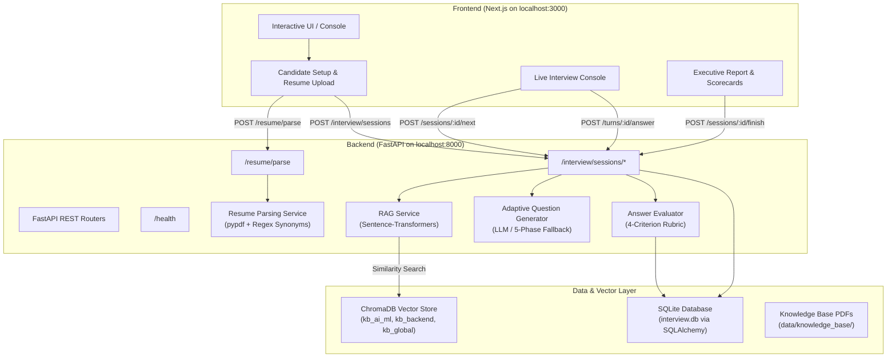

# Role-Based RAG Interviewer

[](https://www.python.org/)
[](https://fastapi.tiangolo.com/)
[](https://nextjs.org/)
[](https://www.typescriptlang.org/)
[](https://www.trychroma.com/)
[](https://pytest.org/)
[](LICENSE)

An intelligent, resume-aware technical interview system powered by **Role-Specific Retrieval-Augmented Generation (RAG)**, automated multi-rubric evaluation, and persistent interview sessions.

---

## 🚀 Overview

Traditional mock interview systems often generate generic questions without considering the candidate's background or the specific depth required for the target engineering role.

The **Role-Based RAG Interviewer** solves this by combining:
- **Resume Signal Extraction:** Automated parsing of candidate resumes (skills, tools, seniority level, domain exposure) from uploaded PDFs.
- **Role-Partitioned RAG Pipeline:** Dense vector retrieval from role-partitioned vector collections in `ChromaDB` using `Sentence-Transformers` (`all-MiniLM-L6-v2`).
- **Grounded & Adaptive Questioning:** Dynamically generating interview questions grounded in reference technical documents with explicit source citations.
- **Multi-Criterion Real-Time Rubric:** Evaluating responses across Technical Accuracy, Depth, Completeness, and Clarity.
- **Relational Session Persistence:** Preserving interview session and turn history in `SQLite` via `SQLAlchemy`.

---

## ✨ Key Features

- **Resume Parsing & Signal Extraction:** PDF extraction using `pypdf` with word-boundary matching and synonym resolution (`C++`, `C#`, `Next.js`, `CI/CD`, `PostgreSQL`, `Kubernetes`, `Sklearn`, `LLMs`, `RAGs`, `REST APIs`).
- **Role-Partitioned RAG Pipeline:** Multi-collection vector storage (`kb_ai_ml_engineer`, `kb_backend_engineer`, `kb_data_scientist`, `kb_global`) using cosine similarity ranking.
- **Citation Grounding:** Enforces verified citations (`[source.pdf (p. X, chunk Y)]`) in all generated questions to ensure answers are grounded in the knowledge base.
- **Adaptive Difficulty & Turn Tracking:** Adjusts question difficulty based on candidate seniority (`Junior`, `Mid-Level`, `Senior`, `Staff/Lead`) and tracks conversation history to generate follow-up questions.
- **Deterministic 5-Phase Fallback:** Full offline capability with deterministic question generation and rubric evaluation when no external LLM API key is configured.
- **4-Criterion Scoring Rubric:** Evaluates responses on **Accuracy (40%)**, **Depth (30%)**, **Completeness (15%)**, and **Clarity (15%)** on a 1–10 scale with automated strengths, weaknesses, and ideal answers.
- **Session Continuity & Persistence:** Relational session and turn state management backed by **SQLAlchemy** and **SQLite**, allowing candidate sessions to be restored across browser refreshes.
- **Modern Next.js 14 UI:** App Router interface with live backend health monitoring, drag-and-drop resume upload, skill chip tags, progress bars, live scorecards, and executive reports.
- **100% Automated Test Coverage:** 40 unit, API, database, and RAG integration tests passing in complete test isolation.

---

## 🏗️ System Architecture



---

## 💻 Local Development Guide

### 1. Prerequisites
- **Python:** 3.11 or higher
- **Node.js:** 18 or higher (with npm)
- (Optional) **Docker** and **Docker Compose**

### 2. Backend Setup
```bash
# Navigate to backend directory
cd backend

# Create virtual environment
python -m venv .venv

# Activate virtual environment
# On Windows:
.venv\Scripts\activate
# On macOS/Linux:
source .venv/bin/activate

# Install dependencies
pip install -r requirements.txt

# Create environment configuration from template
copy .env.example .env

# Start FastAPI server with live reload
uvicorn app.main:app --host 127.0.0.1 --port 8000 --reload
```

The backend will be available at [http://127.0.0.1:8000](http://127.0.0.1:8000).
Interactive Swagger API documentation is available at [http://127.0.0.1:8000/docs](http://127.0.0.1:8000/docs).

### 3. Knowledge Base Ingestion (Optional)
Place your reference PDF documents into `backend/data/knowledge_base/`, then run:
```bash
python scripts/ingest_knowledge.py
```

### 4. Frontend Setup
```bash
# Open a new terminal and navigate to frontend directory
cd frontend

# Install dependencies
npm install

# Start Next.js development server
npm run dev
```

Open [http://localhost:3000](http://localhost:3000) in your browser.

---

## 🐳 Docker Deployment (Local)

To build and run both Backend and Frontend containers locally with persistent storage:

```bash
# Build and run container stack
docker compose up --build -d
```

- **Frontend UI:** [http://localhost:3000](http://localhost:3000)
- **Backend REST API:** [http://localhost:8000](http://localhost:8000)
- **API Documentation:** [http://localhost:8000/docs](http://localhost:8000/docs)
- **Health Check:** [http://localhost:8000/health](http://localhost:8000/health)

To stop containers:
```bash
docker compose down
```

---

## ⚙️ Environment Variables

### Backend Configuration (`backend/.env`)

| Variable | Default Value | Description |
|---|---|---|
| `APP_NAME` | `Role-Based RAG Interviewer` | Application display name. |
| `APP_VERSION` | `1.0.0` | API version string. |
| `DEBUG` | `false` | Enable verbose debugging and error stack traces. |
| `DATABASE_URL` | `sqlite:///data/interview.db` | SQLAlchemy database connection string. |
| `CHROMA_PATH` | `data/chroma` | Directory for persistent ChromaDB embeddings. |
| `KNOWLEDGE_BASE_DIR` | `data/knowledge_base` | Directory containing source PDFs for RAG ingestion. |
| `EMBEDDING_MODEL` | `all-MiniLM-L6-v2` | Sentence-Transformers model name. |
| `TOP_K` | `5` | Number of context chunks retrieved per query. |
| `LLM_BASE_URL` | `https://api.openai.com/v1` | Base URL for OpenAI-compatible LLM providers. |
| `LLM_API_KEY` | *(empty)* | Optional API key. If unset, deterministic fallback is used. |
| `LLM_MODEL` | `gpt-4o-mini` | LLM model identifier. |
| `MAX_TURNS` | `5` | Maximum number of turns per interview session. |
| `CORS_ORIGINS` | `http://localhost:3000,http://127.0.0.1:3000` | Allowed frontend origins for CORS. |

### Frontend Configuration (`frontend/.env.local`)

| Variable | Default Value | Description |
|---|---|---|
| `NEXT_PUBLIC_API_URL` | `http://localhost:8000` | Backend API base URL reachable by the browser client. |

---

## 📡 REST API Documentation

| Method | Endpoint | Description |
|---|---|---|
| `GET` | `/health` | Application and database healthcheck status. |
| `GET` | `/` | Root API status and interactive docs link. |
| `POST` | `/resume/parse` | Upload and parse candidate resume PDF; returns extracted signals. |
| `POST` | `/interview/sessions` | Create a new persistent interview session. |
| `GET` | `/interview/sessions/{session_id}` | Retrieve session details, current status, and turn history. |
| `POST` | `/interview/sessions/{session_id}/next` | Generate the next grounded question for the active session. |
| `POST` | `/interview/turns/{turn_id}/answer` | Submit candidate answer and receive real-time rubric evaluation. |
| `POST` | `/interview/sessions/{session_id}/finish` | Finalize interview session and generate executive summary report. |
| `GET` | `/interview/sessions/{session_id}/summary` | Retrieve the generated final summary report. |
| `GET` | `/interview/sessions` | List interview sessions with pagination (`skip`, `limit`). |

---

## 🧪 Testing

The backend includes an automated test suite executed with Pytest:

```bash
cd backend
python -m pytest tests/ -v
```

**Verified Test Result:**
```
collected 40 items

tests/test_ai_integration.py ........                                    [ 20%]
tests/test_database_layer.py ....                                        [ 30%]
tests/test_foundation.py ......                                          [ 45%]
tests/test_interview_api.py .......                                      [ 62%]
tests/test_rag_pipeline.py .......                                       [ 80%]
tests/test_resume_parser.py ........                                     [100%]

======================= 40 passed, 2 warnings in 27.30s =======================
```

---

## 📁 Repository Structure

```
.
├── .dockerignore
├── .gitignore
├── ASSIGNMENT_MAPPING.md
├── docker-compose.yml
├── LICENSE
├── README.md
├── backend/
│   ├── .dockerignore
│   ├── .env.example
│   ├── Dockerfile
│   ├── requirements.txt
│   ├── app/
│   │   ├── config.py              # Environment configuration & settings
│   │   ├── database.py            # SQLAlchemy database engine & session maker
│   │   ├── main.py                # FastAPI app initialization & CORS middleware
│   │   ├── models.py              # InterviewSession and InterviewTurn ORM models
│   │   ├── schemas.py             # Pydantic request/response validation schemas
│   │   ├── routers/
│   │   │   ├── health.py          # GET /health healthcheck endpoint
│   │   │   ├── interview.py       # Session lifecycle, turns, answers, and summaries
│   │   │   └── resume.py          # POST /resume/parse PDF extraction endpoint
│   │   └── services/
│   │       ├── evaluator.py       # Rubric scoring formula & report generator
│   │       ├── question_generator.py # Adaptive prompts & deterministic fallback
│   │       ├── rag_service.py     # ChromaDB vector store & sliding-window chunks
│   │       └── resume_parser.py   # PDF text & regex synonym extraction engine
│   ├── data/
│   │   ├── chroma/                # ChromaDB vector embeddings
│   │   └── knowledge_base/        # Reference PDFs for RAG ingestion
│   ├── scripts/
│   │   └── ingest_knowledge.py    # Knowledge base ingestion CLI script
│   └── tests/
│       ├── test_ai_integration.py # Adaptive prompts, fallback, and rubric tests
│       ├── test_database_layer.py # ORM models, cascade delete, and schema tests
│       ├── test_foundation.py     # Settings, CORS origins, and health check tests
│       ├── test_interview_api.py  # End-to-end API lifecycle and validation tests
│       ├── test_rag_pipeline.py   # Ingestion, chunking, retrieval, and fallback tests
│       └── test_resume_parser.py  # PDF parsing, synonyms, plurals, and seniority tests
└── frontend/
    ├── .dockerignore
    ├── .env.example
    ├── Dockerfile                 # Multi-stage production build container
    ├── package.json
    ├── package-lock.json
    ├── tsconfig.json
    └── app/
        ├── globals.css            # Dark/light theme styles and layout rules
        ├── layout.tsx             # Root layout with metadata
        ├── page.tsx               # Main multi-stage interview controller
        ├── types.ts               # TypeScript interface contracts
        └── components/
            ├── CandidateSetup.tsx # Resume upload, role select, skill chips
            ├── Header.tsx         # Brand header and backend connection badge
            ├── InterviewConsole.tsx # Grounded question card, answer editor
            └── InterviewSummary.tsx # Scorecards, competency breakdown, report
```

---

## 📜 License

This project is open-source and licensed under the [MIT License](LICENSE).
